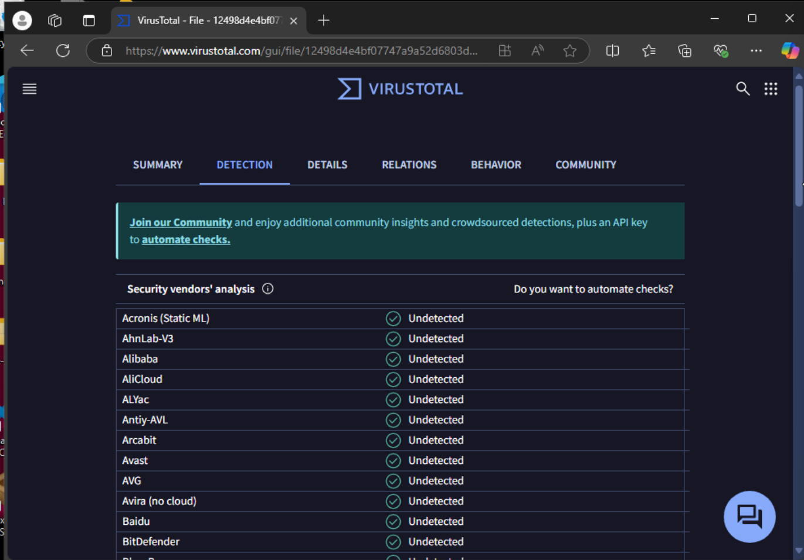

**Static analysis**

1.  **Hash identification:**

-   Test putty file:

-   

-   Official putty file:

-   

-   Running certutil -hashfile \<file path\> MD5/SHA1/SHA256 gives us
    the respective hashes.

-   The hash of the Silly Putty binary does not match the official PuTTY
    binary's hash. This indicates the Silly Putty binary has been
    modified or tampered with compared to the legitimate PuTTY
    executable.

2.  **Architecture analysis:**

-   

-   Lets load the silly putty executable into PE-bear (a PE viewer
    provided by flare vm)

-   Click file hdr, and it takes me to this screen for the test putty
    file:

-   

-   Official executable:

-   

-   At the top, we can see the value for the machine is 14c, meaning
    that it is 32 bit (x86) binary. If it was 64 bit, then it would have
    said 8664. We can also read in the characteristics that is is a 32
    bit word machine

-   The official architecture differs in comparison to the official
    executable

3.  **virusTotal analysis:**

-   Test putty file:

-   

-   

-   Official putty file:

-   

-   

-   Running the test file into virusTotal and looking at the summary
    gives us 60/72 security vendors flagging the file as malicious and
    its main threat is a trojan.

-   Comparing this to the official executable we can see that it is
    infected.

4.  **String analysis:**

-   I am going to use strings and convert the strings into a text file
    using strings \<file path.exe\> \> \<filepath.txt\>

-   

-   We can see below that the test putty file has some suspicious things
    going on like messing with system32, attempting to grab the username
    data, sending passwords with camouflage packets, etc.

-   

-   

-   

-   

**Dynamic analysis**

1.  **Behavior Analysis (Static Behavior Comparison):**

-   I then open wireshark before I open the test putty file to analyze
    the network traffic. (i changed my network on my vm to host only)

-   

-   

-   Unfortunately, i capture now network traffic going out or anything
    suspicious. It appears I must do something inside of the putty for
    it to trigger.

-   However, when I launched the putty executable, I did notice that
    something interesting happens for a split second.

-   

-   For a split second, it opens powershell. Im going to examine the
    executable in proc mon

-   

-   

-   Inside proc mon, I apply these filters to see what it is doing
    inside of powershell

-   I see multiple powershell processes

-   

-   Filtering by the pid of the test putty file, we see the following:

-   

-   Unfortunately, I did not capture anything out of the ordinary. I
    most likely would have to do something inside of the putty file like
    ssh or something.

-   I dont have a server to ssh in

2.  **Network Traffic Analysis:**

-   Unable to

summary

1.  The Silly Putty binary's hash (MD5/SHA256) is different from the
    official PuTTY binary's known hash. This mismatch indicates the
    Silly Putty file has been modified or tampered with compared to the
    legitimate PuTTY executable.

2.  Using PE-bear, the Silly Putty binary is 32-bit (Machine: 0x14c).
    The official PuTTY in this lab appears to have a different
    architecture, confirming they're not identical builds.

3.  On VirusTotal, the Silly Putty sample was heavily flagged (e.g.,
    \~60/72 antivirus engines) as a Trojan or similar malware. By
    contrast, the official PuTTY binary generally shows no or very few
    detections.

4.  Running strings on the Silly Putty binary revealed unusual
    references to system paths, possible attempts to access user data,
    and mention of powershell-related commands. These strings do not
    appear in the official PuTTY binary, indicating malicious or
    trojanized functionality.

5.  Process Monitor and Process Explorer revealed that Silly Putty can
    spawn multiple PowerShell processes---sometimes
    momentarily---suggesting a hidden payload. Official PuTTY never
    launches PowerShell or any secondary processes in normal usage. This
    behavior indicates the Silly Putty binary is likely trojanized and
    performing unauthorized actions in the background.

6.  In Wireshark captures, no immediate or clearly malicious outbound
    connections were seen (only routine Windows multicast/broadcast
    traffic). However, official PuTTY typically only initiates traffic
    to the SSH server specified by the user. The lack of suspicious
    connections in your capture might mean the malicious component
    requires additional triggers or the payload is primarily local
    (e.g., launching PowerShell) rather than network-based.
